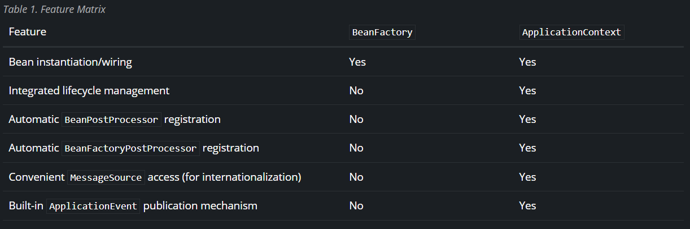

- 출처 : 인프런 김영한님의 스프링 핵심원리(기본편)

## Bean Factory에 대해 설명하라. (은비 + 민욱)
- https://beforb.tistory.com/40

(은비) **IoC Container(Inversion of Control; 제어의 역전)의 최상위 인터페이스**이다. 

즉, Bean Factory 계열의 인터페이스만 구현한 클래스는 "단순히 컨테이너에서 객체를 생성하고 DI(Dependency Injection)를 처리하는 기능만 제공"한다. 또한, 클라이언트의 요청에 의해서 Bean이 사용되는 시점에 생성하는 Lazy Loading 방식을 사용한다.

특징은 다음과 같다.

- Bean을 등록, 생성, 조회 및 반환 관리 수행
- Factory Design Pattern을 구현함으로써 Bean을 생성하고 분배하는 책임을 지는 클래스
- getBean() 메서드를 통해 Bean 조회 가능

하지만 일반적으로는 BeanFactory를 확장한 ```ApplicationContext```를 사용한다.


(민욱)
Spring은 IOC/DI의 구현을 위해서 Spring Container라는 개념을 도입했다. Spring Container란 Bean객체들을 생성해서 주입시키는 역할을 하는데 이 역할을 하는 객체가 바로 Bean Factory이다.

### IoC Container(= Spring Container)

(은비)
- https://dev-coco.tistory.com/80


Container는 보통 객체의 생명주기를 관리하며, 생성된 인스턴스에게 추가적인 기능을 제공하는 것을 일컫는다.

Spring Framework에서도 객체를 생성 및 관리하는 컨테이너를 IoC Container라고 부른다.

- BeanFactory : 객체의 생성과 관리(등록, 생성, 조회, 반환 등) 수행
- ApplicationContext : BeanFactory + α

### Bean
- https://espania.tistory.com/382
- https://developer-ellen.tistory.com/198

```Spring에서 IoC 컨테이너(= Spring 컨테이너)가 관리하는 자바 객체```로서 컨테이너에 의해 생명주기가 관리되는 객체를 의미한다.

또한, 필요할 때마다 IoC 컨테이너에서 가져와서 사용한다.

```@Bean``` 또는 xml 설정을 통해 일반 객체를 Bean으로 등록한다.

생명 주기는 다음과 같다.

```생성``` → ```의존성 주입``` → ```초기화``` → ```사용``` → ```소멸```

```
// 생성 관련한 인터페이스
public interface InitializingBean { 
	void afterPropertiesSet() throws Exception;
}

// 소멸 관련한 인터페이스
public interface DispoasableBean { 
	void destroy() throws Exception;
}

public class Test implements InitializingBean, DisposableBean {

    @Override
    public void afterPropertiesSet() throws Exception {
    	//빈 생성후 메소드 호출
        System.out.println("afterPropertiesSet() 실행");
    }
    
    @Override
    public void destroy() throws Exception {
    	// 소멸을 진행하는 메소드
        System.out.println("destroy() 실행");
    }
   
    
}
```


(민욱)
Spring은 IOC/DI의 구현을 위해서 Spring Container라는 개념을 도입했다. Spring Container란 Bean객체들을 생성해서 주입시키는 역할을 하는데 이 역할을 하는 객체가 바로 Bean Factory이다.

## Application Context에 대해 설명하라. (은비 + 민욱)
(은비)


Bean Factory(인터페이스)를 상속받는 인터페이스로서 Bean을 생성 및 관리하는 기능을 동일하게 제공하지만, ```스프링의 각종 부가 기능```을 추가로 제공한다.

- 메시지 소스를 활용한 국제화 기능: 국가에 따라 해당 국가에서 지원하는 언어로 출력
- 환경 변수: 로컬, 개발, 운영 등을 구분해서 처리
- 애플리케이션 이벤트 : 이벤트를 발행하고 구독하는 모델을 편리하게 지원
  - https://zkdlu.github.io/2021-03-29/Spring-Application-Event/
- 편리한 리소스 조회 : 파일, 클래스 패스, 외부 등에서 리소스를 편리하게 조회

(민욱)
앞에서 Bean Factory가 Spring에서 IOC/DI를 수행하기 위해 만들어진 객체라고 소개하였다. ApplicationContext는 이러한 BeanFactory를 상속받아 기능을 확장한 객체로 생각하면 된다. 따라서 ApplicationContext도 Bean객체를 생성해서 주입시키는 역할을 하며 추가로 몇가지 기능이 확장되었다.
아래 이미지는 spring 공식문서에서 가져온 비교표이다.

1. 두 객체 모두 빈을 생성하고 주입하는 역할을 수행한다.
2. Bean Factory의 경우 Bean객체의 Life Cycle로 Singletone과 Prototype만 제공해주고 있다. 반면 ApplicationContext는 Request,Session,Application LifeCycle을 추가하여 제공해주고 있다.
3. BeanFactory와는 달리 ApplicationContext는 BeanPostProcessor, BeanFactoryPostProcessor를 자동으로 등록해준다.
4. BeanFactory와는 달리 MessageSource 국제화기능을 제공해준다.
5. 

## @Scope에 대해 설명하라. (은비 + 민욱)

먼저 ```Scope```란 Bean이 존재하는 범위를 의미한다.

Scope의 종류는 다음과 같다.

- singleton : 하나의 Bean 정의에 대해 Spring IoC Container에서 단 하나의 객체만 존재
→ Spring 컨테이너 안에서 딱 한 번 생성되며, 컨테이너가 종료 시 동시 소멸
- prototype : 하나의 Bean 정의에 대해 다수의 객체가 존재
- request : 하나의 Bean 정의에 대해 하나의 HTTP request 생명주기 안에 단 하나의 객체만 존재
- session : 하나의 Bean 정의에 대해 하나의 HTTP Session의 생명주기 안에서 단 하나의 객체만 존재
- global session : 하나의 Bean 정의에 대해 하나의 global HTTP Session의 생명주기 안에서 단 하나의 객체만 존재

## Application Context를 상속받고 있는 인터페이스에는 여러가지가 있다. 어떤 것이 있는지 설명하라. (은비 + 민욱)

## Resource Loader가 무엇인지 설명하라. (은비)

## 여기서 말하는 Resource가 무엇인가? (은비)

## Application Event Publisher가 어떤 일을 하는지 설명하라. (민욱)

## Event Driven Programming이 무엇인지 설명하라.

### Event Driven Programming의 장점이 무엇이라 생각하는가?

### 동기와 비동기의 차이가 무엇이라 생각하는가?

### 동기와 비교했을 때 비동기의 장점이 무엇인가?

### 비동기로 하면 총 시간이 빨라지는가?

### Blocking과 non-Blocking은 어떤 차이가 있는가?

### Log4j가 Console에 찍는 것 보다 왜 빠를까?

## Resource Loader나 Resource Validation 같은 것을 추상화 해놓았는데 Resource 추상화가 무엇인지 설명하라.

### Validation이 뭔지 설명하라.

## Data Binding이 무엇인지 설명하라.

### Spring은 어떤 것을 써서 Data Binding을 하는가?

### Converter나 Formatter가 무엇인지 설명하라.

## Property Editer가 무엇인지 설명하라.

## SpEL이 어떤 것인지 설명하라

## @Value가 뭔지 설명하라.

## AOP에 대해 설명하라.

### Advice Point Cut, Join Point가 무엇인지 설명하라.

## Servlet이 무엇인지 설명하라.

### Servlet의 생명주기에 대해 설명하라.

## Dispatcher Servlet이 무엇인지 설명하라.

### HandlingMapping, HandlerAdapter가 무엇인지 설명하라.

### 실제로 Dispatcher Servlet이 요청을 받았을 때, 어떤 순서로 처리되는지 설명하라.
